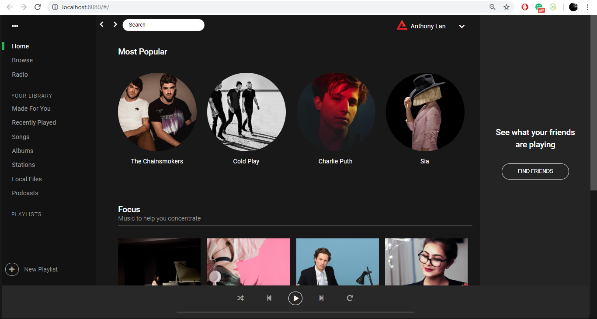
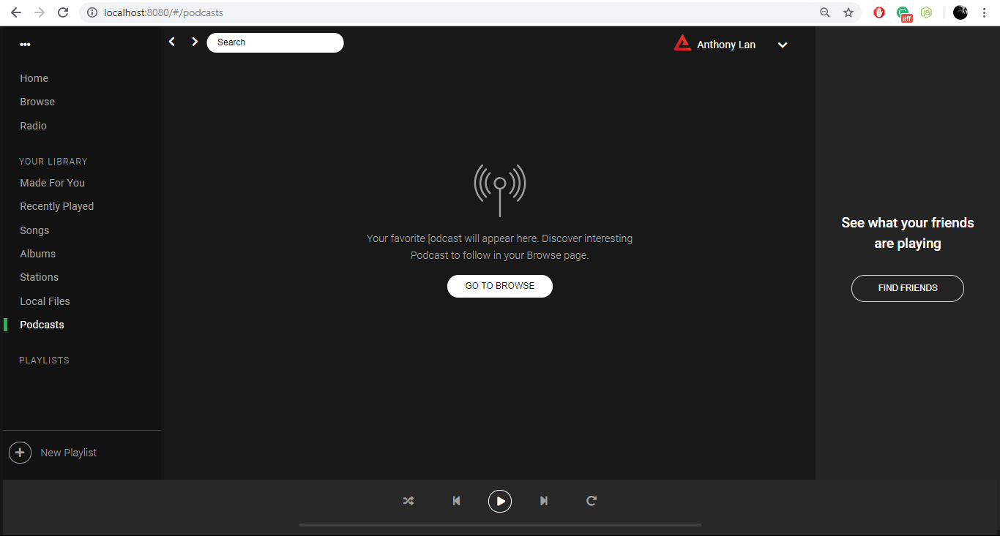
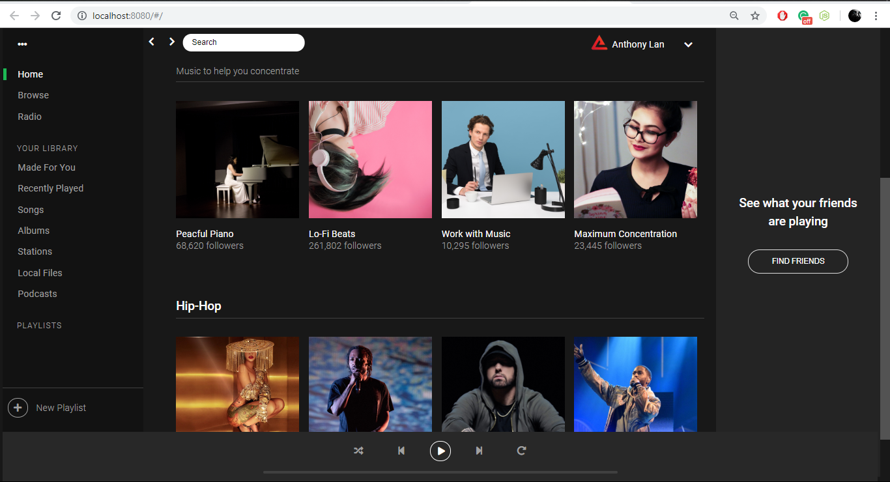
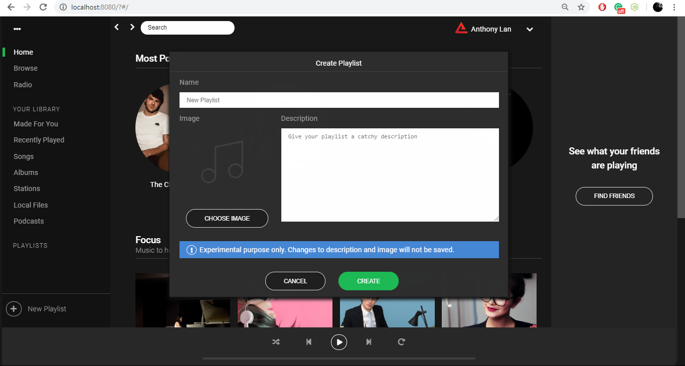

# Spotify Clone

I usually upload my projects when they are completly finished. However I'll need more time to complete this one, so I thought to myself why not track every stage of the projects as it undergoes different phases before its completion.

## First Stage

* UI setup
* Static assets








## Project setup
```
npm install
```

### Compiles and hot-reloads for development
```
npm run serve
```


